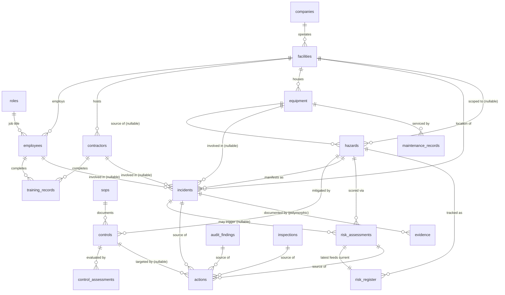

# RISKON V0.1 — Database & Synthetic Data Foundation

Fictional company: **Rex Industrial Manufacturing**, a multinational manufacturer with 7 facilities across
5 countries — Rex North Plant, Rex Central Plant, and Rex South Plant in the United States, plus Rex UK
Plant (Manchester), Rex Germany Plant (Stuttgart), Rex India Plant (Pune), and Rex Australia Plant
(Melbourne). All data below is synthetic and fictional — no real people, no real company, no real incidents.

Engine: **SQLite** (`database/riskon.db`), chosen as the lightweight prototype database that migrates
to PostgreSQL/Supabase with minimal changes (see "Migrating to PostgreSQL" at the end of this doc).

| Artifact | Path |
|---|---|
| Schema (DDL) | [`database/schema.sql`](../database/schema.sql) |
| Generator (builds the DB from nothing) | [`database/generate_database.py`](../database/generate_database.py) |
| Validator | [`database/validate.py`](../database/validate.py) |
| SQLite database | `database/riskon.db` |
| Per-table CSV exports | `database/csv/*.csv` |
| Test scenarios (ground truth) | `database/test_scenarios.json` |
| One real example row per table | `database/example_records.json` |
| Validation report (generated) | `database/validation_report.md` |
| Sample narrative documents | [`docs/sample-documents/`](sample-documents/) |

To rebuild everything from scratch: `python3 database/generate_database.py && python3 database/validate.py`
(deterministic — seeded RNG, same output every run).

---

## 1. Entity mapping — what you asked for vs. what was built

The spec listed 20 entities. Two pairs are intentionally **merged into one table each**, and one entity is
**split into two tables**. This isn't a shortcut — it's the more correct relational design, and every
decision is because the two "separate" entities would otherwise be identical schemas with one column
differing:

| Your entity | Physical table(s) | Why |
|---|---|---|
| 1. Companies | `companies` | — |
| 2. Facilities | `facilities` | — |
| 3. Employees/Roles | `roles` + `employees` | Split, not merged — a role (title/department) is reused by many employees and referenced independently by SOP owners, action owners, and assessors. Folding role as a text column onto `employees` would prevent that reuse. |
| 4. Contractors | `contractors` | — |
| 5. Equipment | `equipment` | — |
| 6. Incidents | `incidents` | — |
| 7. Near Misses | **merged into `incidents`** (`incident_type = 'Near Miss'`) | Your own field spec ("Each incident should contain...") lists near-miss as one of the incident *type* variations, not a different shape of record. A second table would be a byte-for-byte duplicate schema. |
| 8. Hazards | `hazards` | — |
| 9. Risk Assessments | `risk_assessments` | Point-in-time scoring events — the historical trail. |
| 10. Risk Register | `risk_register` | The *current* state per hazard (one open row per actively-tracked hazard, pointing at its latest assessment). Kept separate from `risk_assessments` deliberately: assessments are an append-only history, the register is a living summary — this is standard practice and lets you show a risk trend without mutating history. |
| 11. Controls | `controls` | — |
| 12. Control Assessments | `control_assessments` | — |
| 13. Corrective Actions | **merged into `actions`** (`action_type = 'Corrective'`) | Same rationale as #7 — identical fields to Preventive Actions. |
| 14. Preventive Actions | **merged into `actions`** (`action_type = 'Preventive'`) | |
| 15. SOPs | `sops` | — |
| 16. Inspections | `inspections` | — |
| 17. Training Records | `training_records` | — |
| 18. Maintenance Records | `maintenance_records` | — |
| 19. Audit Findings | `audit_findings` | — |
| 20. Evidence/Attachments | `evidence` | Polymorphic (`related_entity_type` + `related_entity_id`) — the one place a real FK isn't possible, since evidence can attach to six different tables. |

**19 physical tables**, all requested data still fully representable, no duplicate schemas.

---

## 2. Entity-relationship overview



**Reading the incident chain the spec asked for** (`Incident → Facility → Location → Equipment → Hazard →
Existing Control → Risk Assessment → Corrective Action → Responsible Role → Evidence → Closure`), concretely,
using real generated IDs:

```
INC-0008  (facility_id=FAC-001, location="Punch Press area, FAC-001", equipment_id=EQ-0001)
  → hazard_id = HAZ-0003 ("Punch press point-of-operation guarding is prone to being propped open...")
    → controls_for_hazard(HAZ-0003) = CTL-0001 "Fixed Machine Guard Interlock Program"
      → control_assessments show it oscillating Effective → Partially Effective → Ineffective → ... (never sustained)
    → risk_register row RISK-0005, current_level = Critical, owner = EMP-0002 (a Safety Manager — the "Responsible Role")
    → actions ACT-0001..0004 all target related_control_id=CTL-0001, four of them Overdue with reschedule_count >= 2
  → evidence EVD-* rows with related_entity_type='Incident', related_entity_id='INC-0008'
  → incidents.closure_status = 'Closed', closed_date set once investigation_status = 'Completed'
```

---

## 3. Schema reference

For every table: fields (name — type — nullable — notes), primary key, foreign keys, and one real example
record pulled straight from the generated database (not hand-typed). Full DDL with `CHECK` constraints is
in [`database/schema.sql`](../database/schema.sql); this section is the readable companion to it.

### 3.1 `companies`
| Field | Type | Notes |
|---|---|---|
| company_id **PK** | TEXT | `CO-001` |
| name | TEXT | |
| industry | TEXT | |
| founded_year | INTEGER | |
| headquarters_city | TEXT | |
| headquarters_state | TEXT | |

No FKs (root entity). **Example:** `{"company_id":"CO-001","name":"Rex Industrial Manufacturing","industry":"Industrial Manufacturing","founded_year":1974,"headquarters_city":"Canton","headquarters_state":"OH"}`

### 3.2 `facilities`
| Field | Type | Notes |
|---|---|---|
| facility_id **PK** | TEXT | `FAC-001`..`FAC-007` |
| company_id **FK→companies** | TEXT | |
| name | TEXT | "Rex North/Central/South Plant" (US), "Rex UK/Germany/India/Australia Plant" |
| facility_type | TEXT | |
| city, state, country, address | TEXT | `state` holds a US state for the 3 US plants and a region/province (e.g. "Baden-Württemberg", "Maharashtra") for the 4 international ones |
| square_footage, year_established, employee_capacity | INTEGER | |

**Example:** `{"facility_id":"FAC-001","company_id":"CO-001","name":"Rex North Plant","facility_type":"Heavy Manufacturing","city":"Canton","state":"OH","country":"United States","address":"4820 Blue Ridge Industrial Pkwy, Canton, OH 44706","square_footage":285000,"year_established":1978,"employee_capacity":340}`

### 3.3 `roles`
| Field | Type | Notes |
|---|---|---|
| role_id **PK** | TEXT | `ROLE-01`..`ROLE-18` |
| title | TEXT | e.g. "Safety Manager" |
| department | TEXT | |
| description | TEXT | |
| is_safety_critical | INTEGER (0/1) | drives training-record generation |

**Example:** `{"role_id":"ROLE-01","title":"Plant Manager","department":"Operations","description":"Plant Manager within the Operations function.","is_safety_critical":1}`

### 3.4 `employees`
| Field | Type | Notes |
|---|---|---|
| employee_id **PK** | TEXT | `EMP-0001`..`EMP-0030` |
| facility_id **FK→facilities** | TEXT | |
| role_id **FK→roles** | TEXT | |
| first_name, last_name | TEXT | fictional |
| email **UNIQUE** | TEXT | `@rexindustrial-example.com` |
| hire_date | TEXT (date) | |
| is_active | INTEGER (0/1) | |

**Example:** `{"employee_id":"EMP-0001","facility_id":"FAC-002","role_id":"ROLE-01","first_name":"Steven","last_name":"Rodriguez","email":"steven.rodriguez@rexindustrial-example.com","hire_date":"2015-09-05","is_active":1}`

### 3.5 `contractors`
| Field | Type | Notes |
|---|---|---|
| contractor_id **PK** | TEXT | `CTR-0001`..`CTR-0020` |
| contracting_firm | TEXT | fictional firm |
| trade | TEXT | |
| primary_facility_id **FK→facilities** | TEXT | |
| assigned_date | TEXT (date) | |
| safety_orientation_completed | INTEGER (0/1) | **4 contractors deliberately = 0** (Pattern 6) |
| safety_orientation_date | TEXT (date), nullable | |
| status | TEXT | Active/Inactive |

**Example:** `{"contractor_id":"CTR-0001","contracting_firm":"Vantage Industrial Coatings","trade":"Painting/Coatings","primary_facility_id":"FAC-002","assigned_date":"2026-05-05","safety_orientation_completed":1,"safety_orientation_date":"2026-04-30","status":"Active"}`

### 3.6 `equipment`
| Field | Type | Notes |
|---|---|---|
| equipment_id **PK** | TEXT | `EQ-0001`..`EQ-0030` |
| facility_id **FK→facilities** | TEXT | |
| equipment_type, category, manufacturer, model_number, serial_number | TEXT | |
| install_date, last_maintenance_date, next_maintenance_due | TEXT (date) | |
| status | TEXT | Operational/Under Maintenance/Decommissioned |
| criticality | TEXT | Low/Medium/High |

**Example:** `{"equipment_id":"EQ-0001","facility_id":"FAC-001","equipment_type":"Punch Press","category":"Production","manufacturer":"Amada","model_number":"PX-512","serial_number":"SN654968","install_date":"2002-03-19","last_maintenance_date":"2025-12-24","next_maintenance_due":"2026-04-23","status":"Operational","criticality":"High"}`

### 3.7 `sops`
| Field | Type | Notes |
|---|---|---|
| sop_id **PK** | TEXT | `SOP-0001`..`SOP-0030` |
| title, category, version | TEXT | |
| effective_date, next_review_date | TEXT (date) | |
| owner_employee_id **FK→employees** | TEXT | |
| facility_id **FK→facilities**, nullable | TEXT | NULL = company-wide |
| status | TEXT | Active/Under Revision/Retired |

**Example:** `{"sop_id":"SOP-0001","title":"Lockout/Tagout (LOTO) Procedure","category":"Energy Control","version":"1.3","effective_date":"2021-09-13","next_review_date":"2023-09-13","owner_employee_id":"EMP-0018","facility_id":"FAC-003","status":"Active"}`

### 3.8 `hazards`
| Field | Type | Notes |
|---|---|---|
| hazard_id **PK** | TEXT | `HAZ-0001`..`HAZ-0077` |
| hazard_category | TEXT | 18 categories (see §5) |
| description | TEXT | |
| facility_id **FK→facilities**, nullable | TEXT | NULL only if equipment_id is also NULL (genuinely company-wide) |
| equipment_id **FK→equipment**, nullable | TEXT | |
| typical_consequence | TEXT | |
| identified_date | TEXT (date) | |
| identified_by_employee_id **FK→employees**, nullable | TEXT | |
| status | TEXT | Active/Mitigated/Closed |

**Example:** `{"hazard_id":"HAZ-0001","hazard_category":"Forklift / Vehicle Incident","description":"Pedestrian and forklift traffic share aisles without segregated walkways in the North Plant warehouse.","facility_id":"FAC-001","equipment_id":"EQ-0003","typical_consequence":"Struck-by injury to pedestrian","identified_date":"2025-11-03","identified_by_employee_id":"EMP-0004","status":"Active"}`

### 3.9 `controls`
| Field | Type | Notes |
|---|---|---|
| control_id **PK** | TEXT | `CTL-0001`..`CTL-0051` |
| control_name | TEXT | |
| control_type | TEXT | Engineering/Administrative/PPE/Procedural |
| hazard_id **FK→hazards** | TEXT | |
| related_sop_id **FK→sops**, nullable | TEXT | |
| facility_id **FK→facilities**, nullable | TEXT | NULL = company-wide program |
| description | TEXT | |
| implemented_date | TEXT (date) | |
| status | TEXT | Active/Retired |

**Example:** `{"control_id":"CTL-0001","control_name":"Fixed Machine Guard Interlock Program","control_type":"Engineering","hazard_id":"HAZ-0003","related_sop_id":"SOP-0004","facility_id":null,"description":"Interlocked point-of-operation guards on punch presses, verified by periodic inspection.","implemented_date":"2021-03-01","status":"Active"}`

### 3.10 `maintenance_records`
| Field | Type | Notes |
|---|---|---|
| maintenance_record_id **PK** | TEXT | `MNT-0001`..`MNT-0051` |
| equipment_id **FK→equipment** | TEXT | |
| facility_id **FK→facilities** | TEXT | |
| maintenance_type | TEXT | Preventive/Corrective/Inspection |
| scheduled_date | TEXT (date) | |
| actual_date, nullable | TEXT (date) | NULL if never performed (Overdue/Scheduled) |
| delay_days | INTEGER | 0 unless Delayed/Overdue |
| performed_by_employee_id **FK→employees**, nullable | TEXT | |
| description | TEXT | |
| status | TEXT | Completed/Delayed/Overdue/Scheduled |
| related_incident_id | TEXT, nullable, **logical FK →incidents** (undeclared — see schema.sql note) | set for Pattern 5 rows |

**Example:** `{"maintenance_record_id":"MNT-0001","equipment_id":"EQ-0005","facility_id":"FAC-002","maintenance_type":"Preventive","scheduled_date":"2026-04-07","actual_date":"2026-05-11","delay_days":34,"performed_by_employee_id":"EMP-0025","description":"Scheduled preventive maintenance on Air Compressor delayed due to backlog/parts availability.","status":"Delayed","related_incident_id":"INC-0014"}`

### 3.11 `incidents` (near misses included — see §1)
| Field | Type | Notes |
|---|---|---|
| incident_id **PK** | TEXT | `INC-0001`..`INC-0100` |
| facility_id **FK→facilities** | TEXT | |
| location | TEXT | free text |
| incident_datetime | TEXT (datetime) | |
| incident_type | TEXT | Near Miss/Injury/Property Damage/Environmental/Equipment Failure/Unsafe Condition |
| description | TEXT | |
| equipment_id **FK→equipment**, nullable | TEXT | |
| hazard_id **FK→hazards**, nullable | TEXT | |
| involved_employee_id **FK→employees**, nullable | TEXT | mutually exclusive with contractor (CHECK constraint) |
| involved_contractor_id **FK→contractors**, nullable | TEXT | |
| injury_status | TEXT | |
| potential_consequence | TEXT | |
| initial_severity | TEXT | Low/Medium/High/Critical |
| immediate_action | TEXT | |
| investigation_status | TEXT | Not Started/In Progress/Completed |
| root_cause_category | TEXT, nullable | only set once investigation Completed |
| related_risk_register_id | TEXT, nullable, **logical FK →risk_register** (undeclared — see schema.sql note) | |
| reported_by_employee_id **FK→employees** | TEXT | |
| reported_at | TEXT (datetime) | |
| closure_status | TEXT | Open/Closed |
| closed_date | TEXT (date), nullable | |

**Example:** `{"incident_id":"INC-0001","facility_id":"FAC-001","location":"Forklift (Electric) area, FAC-001","incident_datetime":"2026-03-12 13:00:00","incident_type":"Near Miss","description":"Forklift struck a storage rack while maneuvering near Forklift (Electric); minor property damage.","equipment_id":"EQ-0003","hazard_id":"HAZ-0001","involved_employee_id":null,"involved_contractor_id":null,"injury_status":"None","potential_consequence":"Struck-by injury or property damage","initial_severity":"Medium","immediate_action":"Work paused; area inspected; supervisor and EHS notified.","investigation_status":"Completed","root_cause_category":"Communication Breakdown","related_risk_register_id":"RISK-0047","reported_by_employee_id":"EMP-0006","reported_at":"2026-03-12 15:00:00","closure_status":"Closed","closed_date":"2026-04-02"}`

### 3.12 `risk_assessments`
| Field | Type | Notes |
|---|---|---|
| risk_assessment_id **PK** | TEXT | `RA-0001`..`RA-0050` |
| hazard_id **FK→hazards** | TEXT | |
| facility_id **FK→facilities** | TEXT | see §4 for attribution rule |
| equipment_id **FK→equipment**, nullable | TEXT | |
| source_incident_id **FK→incidents**, nullable | TEXT | |
| assessment_date | TEXT (date) | |
| assessed_by_employee_id **FK→employees** | TEXT | |
| likelihood, severity | INTEGER 1-5 | |
| raw_score | INTEGER | likelihood × severity |
| control_effectiveness_rating | TEXT | Effective/Partially Effective/Ineffective/Not Assessed |
| control_effectiveness_factor | REAL | see §6 |
| recurrence_count_trailing_12mo | INTEGER | real computed count, not invented |
| recurrence_factor, trend, trend_factor | REAL/TEXT/REAL | see §6 |
| adjusted_score | REAL | final score, clipped [0,25] |
| risk_level | TEXT | Low/Medium/High/Critical |
| methodology_notes | TEXT | the arithmetic, spelled out per-row |
| status | TEXT | Current/Superseded |

**Example:** `{"risk_assessment_id":"RA-0001","hazard_id":"HAZ-0001","facility_id":"FAC-001","equipment_id":"EQ-0003","source_incident_id":null,"assessment_date":"2026-08-21","assessed_by_employee_id":"EMP-0007","likelihood":3,"severity":4,"raw_score":12,"control_effectiveness_rating":"Partially Effective","control_effectiveness_factor":0.85,"recurrence_count_trailing_12mo":3,"recurrence_factor":1.3,"trend":"Increasing","trend_factor":1.1,"adjusted_score":14.6,"risk_level":"High","methodology_notes":"raw_score = likelihood(3) x severity(4) = 12. control_effectiveness_factor=0.85 (rating: Partially Effective). recurrence_factor=1.3 (3 incidents trailing 12mo). trend_factor=1.1 (trend: Increasing). adjusted_score = 12 x 0.85 x 1.3 x 1.1 = 14.6, clipped to [0,25].","status":"Current"}`

### 3.13 `risk_register`
| Field | Type | Notes |
|---|---|---|
| risk_register_id **PK** | TEXT | `RISK-0001`..`RISK-0049` |
| hazard_id **FK→hazards** | TEXT | one row per hazard with ≥1 assessment |
| facility_id **FK→facilities** | TEXT | |
| current_risk_assessment_id **FK→risk_assessments** | TEXT | points at the latest assessment |
| title | TEXT | |
| current_score | REAL | copied from the latest assessment |
| current_level | TEXT | |
| owner_employee_id **FK→employees** | TEXT | |
| created_date | TEXT (date) | |
| created_from | TEXT | Incident/Proactive Assessment/Audit Finding |
| last_reviewed_date, next_review_due | TEXT (date) | |
| status | TEXT | Open/Mitigated/Closed |

**Example:** `{"risk_register_id":"RISK-0001","hazard_id":"HAZ-0063","facility_id":"FAC-002","current_risk_assessment_id":"RA-0034","title":"Caught-In / Caught-Between — HAZ-0063","current_score":4.0,"current_level":"Low","owner_employee_id":"EMP-0010","created_date":"2025-03-02","created_from":"Incident","last_reviewed_date":"2025-03-02","next_review_due":"2025-08-29","status":"Open"}`

### 3.14 `control_assessments`
| Field | Type | Notes |
|---|---|---|
| control_assessment_id **PK** | TEXT | `CTLA-0001`..`CTLA-0059` |
| control_id **FK→controls** | TEXT | |
| assessment_date | TEXT (date) | |
| assessed_by_employee_id **FK→employees** | TEXT | |
| effectiveness_rating | TEXT | Effective/Partially Effective/Ineffective |
| findings | TEXT | |
| related_incident_id **FK→incidents**, nullable | TEXT | |
| related_inspection_id | TEXT, nullable, **logical FK →inspections** (undeclared, unused in this generation pass) | |

**Example:** `{"control_assessment_id":"CTLA-0001","control_id":"CTL-0001","assessment_date":"2025-02-10","assessed_by_employee_id":"EMP-0002","effectiveness_rating":"Effective","findings":"Interlocked guards verified in place and functioning during scheduled walkthrough.","related_incident_id":null,"related_inspection_id":null}`

### 3.15 `inspections`
| Field | Type | Notes |
|---|---|---|
| inspection_id **PK** | TEXT | `INSP-0001`..`INSP-0075` |
| facility_id **FK→facilities** | TEXT | |
| inspection_type | TEXT | |
| inspection_date | TEXT (date) | |
| inspector_employee_id **FK→employees** | TEXT | |
| equipment_id **FK→equipment**, nullable | TEXT | |
| area_location | TEXT | |
| findings_summary | TEXT | |
| deficiencies_found | INTEGER | |
| status | TEXT | Completed/Findings Open |

**Example:** `{"inspection_id":"INSP-0001","facility_id":"FAC-001","inspection_type":"Equipment Inspection","inspection_date":"2025-09-21","inspector_employee_id":"EMP-0007","equipment_id":"EQ-0001","area_location":"Punch Press area","findings_summary":"2 deficiency(ies) noted during equipment inspection in the Punch Press area; see linked corrective actions.","deficiencies_found":2,"status":"Findings Open"}`

### 3.16 `audit_findings`
| Field | Type | Notes |
|---|---|---|
| audit_finding_id **PK** | TEXT | `AUD-0001`..`AUD-0030` |
| facility_id **FK→facilities** | TEXT | |
| audit_date | TEXT (date) | |
| auditor_name | TEXT | internal employee name+"(Internal Audit)" or external firm |
| auditor_employee_id **FK→employees**, nullable | TEXT | NULL = external auditor |
| finding_category | TEXT | |
| description | TEXT | |
| severity | TEXT | Low/Medium/High/Critical |
| related_sop_id **FK→sops**, nullable | TEXT | |
| related_control_id **FK→controls**, nullable | TEXT | |
| status | TEXT | Open/Closed |

**Example:** `{"audit_finding_id":"AUD-0001","facility_id":"FAC-001","audit_date":"2025-12-08","auditor_name":"Cornerstone Risk Advisors","auditor_employee_id":null,"finding_category":"Machine Safety","description":"Point-of-operation guarding on punch press equipment was found defeated during the walkthrough; this matches a condition noted in a prior internal control assessment and at least one recent incident report.","severity":"High","related_sop_id":"SOP-0004","related_control_id":"CTL-0001","status":"Closed"}`

### 3.17 `actions` (corrective + preventive — see §1)
| Field | Type | Notes |
|---|---|---|
| action_id **PK** | TEXT | `ACT-0001`..`ACT-0100` |
| action_type | TEXT | Corrective/Preventive |
| source_type | TEXT | Incident/Audit Finding/Inspection/Risk Assessment |
| source_incident_id / source_audit_finding_id / source_inspection_id / source_risk_assessment_id | TEXT, nullable **FKs** | exactly one populated, matching source_type (CHECK constraint) |
| related_control_id **FK→controls**, nullable | TEXT | |
| description | TEXT | |
| facility_id **FK→facilities** | TEXT | |
| owner_employee_id **FK→employees** | TEXT | |
| created_date, original_due_date, due_date | TEXT (date) | due_date shifts on reschedule |
| reschedule_count | INTEGER | **Pattern 3 marker**: ≥2 = repeat slippage |
| status | TEXT | Open/In Progress/Completed/Overdue |
| completion_date | TEXT (date), nullable | |
| verification_method | TEXT | |

**Example:** `{"action_id":"ACT-0001","action_type":"Corrective","source_type":"Incident","source_incident_id":"INC-0008","source_audit_finding_id":null,"source_inspection_id":null,"source_risk_assessment_id":null,"related_control_id":"CTL-0001","description":"Repair/upgrade punch press guard interlock and confirm it cannot be propped open.","facility_id":"FAC-001","owner_employee_id":"EMP-0001","created_date":"2025-09-02","original_due_date":"2025-09-23","due_date":"2025-11-04","reschedule_count":2,"status":"Overdue","completion_date":null,"verification_method":"Supervisor sign-off"}`

### 3.18 `training_records`
| Field | Type | Notes |
|---|---|---|
| training_record_id **PK** | TEXT | `TRN-0001`..`TRN-0050` |
| employee_id **FK→employees**, nullable | TEXT | exactly one of employee/contractor set (CHECK) |
| contractor_id **FK→contractors**, nullable | TEXT | |
| training_topic | TEXT | |
| training_date | TEXT (date), nullable | NULL if status='Not Completed' |
| expiry_date | TEXT (date), nullable | |
| status | TEXT | Current/Expired/Not Completed |
| conducted_by_employee_id **FK→employees**, nullable | TEXT | |
| result | TEXT, nullable | |

**Example:** `{"training_record_id":"TRN-0001","employee_id":null,"contractor_id":"CTR-0003","training_topic":"Lockout/Tagout (LOTO)","training_date":"2024-02-11","expiry_date":"2025-02-10","status":"Expired","conducted_by_employee_id":"EMP-0009","result":"Pass (expired)"}`

### 3.19 `evidence`
| Field | Type | Notes |
|---|---|---|
| evidence_id **PK** | TEXT | `EVD-0001`..`EVD-0106` |
| related_entity_type | TEXT | Incident/Inspection/Audit Finding/Action/Training Record/Maintenance Record |
| related_entity_id | TEXT | **polymorphic** — the id within whichever table `related_entity_type` names; not a single-table FK by construction |
| file_name, file_type, description | TEXT | fictional metadata only — no real files |
| uploaded_by_employee_id **FK→employees**, nullable | TEXT | |
| uploaded_date | TEXT (date) | |

**Example:** `{"evidence_id":"EVD-0001","related_entity_type":"Incident","related_entity_id":"INC-0010","file_name":"INC-0010-scene-photo-01.jpg","file_type":"image/jpeg","description":"Scene photo documenting conditions at time of report for INC-0010.","uploaded_by_employee_id":"EMP-0027","uploaded_date":"2025-12-22"}`

---

## 4. Data volume actually generated

| Table | Spec target | Actual |
|---|---|---|
| facilities | 3 | 3 |
| equipment | 30 | 30 |
| employees | 30 | 30 |
| contractors | 20 | 20 |
| incidents (incl. near misses) | 100 | 100 |
| risk_assessments | 50 | 50 |
| hazards | 75 | 77 |
| actions (corrective+preventive) | 100 | 100 |
| controls | 50 | 51 |
| SOPs | 30 | 30 |
| inspections | 75 | 75 |
| maintenance_records | 50 | 51 |
| training_records | 50 | 50 |
| audit_findings | 30 | 30 |
| control_assessments | *(not specified)* | 60 |
| risk_register | *(derived)* | 49 |
| evidence | *(not specified)* | 106 |
| roles | *(catalog)* | 18 |

Minor overshoots (77 vs 75, 51 vs 50, 51 vs 50) come from deliberately adding a couple of extra rows to
seed patterns cleanly (e.g. two "Fall / Working at Height" hazards added on top of the 75-row background
draw) — all within the "approximately" tolerance the spec asked for.

Operating window: **2025-01-01 to 2026-09-03** (~20 months) — tight enough that monthly trend charts stay
legible, long enough to show real recurrence and trend behavior.

---

## 5. The 6 deliberate patterns

These are seeded into the data generation logic itself (not labeled anywhere in the data), so a risk
intelligence engine has to actually find them via the relationships, not read a flag. Ground truth for
each — the exact IDs involved — lives in `database/test_scenarios.json`; **that file is a dev/test fixture,
never surfaced in the product UI.**

| # | Pattern | Where it lives |
|---|---|---|
| 1 | Forklift/pedestrian near misses at 2 facilities | 7 incidents (4 North, 3 South), 2 distinct hazard rows, 2 distinct forklift equipment ids |
| 2 | Repeated machine-guarding incidents, same machine type | 6 incidents across 2 Punch Press units (North + Central), one shared hazard row |
| 3 | Corrective actions repeatedly overdue | 14 actions with `reschedule_count >= 2` and `status='Overdue'`, visible from 3 angles: one control, one owner, one facility |
| 4 | A control repeatedly failing | `CTL-0001` (Fixed Machine Guard Interlock Program) reassessed 5 times, oscillating Partially-Effective/Ineffective, tied to Pattern 2's incidents and an independent external audit finding (`AUD-0001`) that flags the *same* control |
| 5 | Incidents increasing after maintenance delays | 3 delayed-maintenance events (2 equipment ids) each followed by an Equipment Failure incident on the *same equipment* 6-15 days later |
| 6 | Contractor incidents tied to training gaps | 4 contractors with `Not Completed`/`Expired` status on a directly relevant safety topic, producing 6 incidents |

Patterns 3 and 4 deliberately overlap (the same guard-interlock fix keeps slipping past its due date) —
that's realistic, and it's also a good test of whether the engine can connect a control-failure pattern to
an action-slippage pattern rather than treating them as unrelated.

---

## 6. Risk scoring model (prototype — not a universal methodology)

> This is RISKON's **prototype** scoring framework. It is not a substitute for a validated industrial risk
> methodology, and it is not claimed to be "correct" for any specific regulatory or insurance context. In a
> real deployment this would be **configurable per company** — the weighting factors below are a
> transparent, inspectable starting point, not a fixed standard.

For every `risk_assessments` row:

```
raw_score = likelihood (1-5) × severity (1-5)                          → range 1-25

control_effectiveness_factor, from the MOST RECENT control_assessment
  for a control tied to this hazard, as of the assessment date:
    Effective            → 0.60   (meaningful risk reduction credited)
    Partially Effective  → 0.85
    Ineffective          → 1.00   (no credit)
    Not Assessed         → 1.00   (no credit — absence of evidence is never treated as evidence of control)

recurrence_factor, from the ACTUAL count of incidents against this
  hazard in the trailing 12 months (computed from real incident rows,
  never estimated):
    0 prior incidents     → 1.00
    1-2 prior incidents   → 1.15
    3+ prior incidents    → 1.30

trend_factor, from comparing incident count in the trailing 6 months
  vs. the 6 months before that, for this hazard:
    Increasing  → 1.10
    Stable      → 1.00
    Decreasing  → 0.90

adjusted_score = raw_score × control_effectiveness_factor × recurrence_factor × trend_factor
                 clipped to [0, 25]

risk_level:  Low (<6)  |  Medium (6-11)  |  High (12-19)  |  Critical (20-25)
```

Every `risk_assessments.methodology_notes` field spells out this exact arithmetic for that specific row —
e.g. `"raw_score = likelihood(3) x severity(4) = 12. control_effectiveness_factor=0.85 (rating: Partially
Effective). recurrence_factor=1.3 (3 incidents trailing 12mo). trend_factor=1.1 (trend: Increasing).
adjusted_score = 12 x 0.85 x 1.3 x 1.1 = 14.6"` — so a reviewer never has to trust the number, they can
re-derive it. This mirrors the reasoning engine's own rule (design conversation, [`docs/ai-reasoning-engine.md`](ai-reasoning-engine.md)) that every AI-influenced number carries its evidence with it.

**Why this shape:** likelihood×severity is the industry-standard starting point (and is what the frontend's
risk matrix already visualizes); the three multipliers layer in exactly the three things the spec asked
for — control effectiveness, recurrence, and trend — without inventing a fourth. Nothing here is pulled
from an external standard (ISO 31000, ANSI/ASSP Z10, etc.) and none should be implied; a real company
configuring RISKON would replace the four numbers above with their own methodology's weights.

---

## 7. Sample narrative documents

Realistic fictional documents that read like what a plant would actually produce, cross-referencing real
IDs from the database (not invented separately from it) — in [`docs/sample-documents/`](sample-documents/):

- [`incident-report-INC-0008.md`](sample-documents/incident-report-INC-0008.md) — the first punch-press guarding incident
- [`risk-assessment-RA-0003.md`](sample-documents/risk-assessment-RA-0003.md) — the resulting Critical-band risk assessment
- [`audit-finding-AUD-0001.md`](sample-documents/audit-finding-AUD-0001.md) — the external audit that independently flags the same control
- [`inspection-report-INSP-0002.md`](sample-documents/inspection-report-INSP-0002.md) — equipment inspection on the same press type at Rex Central Plant
- [`maintenance-report-MNT-0001.md`](sample-documents/maintenance-report-MNT-0001.md) — a Pattern 5 delayed-maintenance record
- [`sop-excerpt-SOP-0004.md`](sample-documents/sop-excerpt-SOP-0004.md) — the Machine Guarding Standard the control implements
- [`training-record-TRN-0001.md`](sample-documents/training-record-TRN-0001.md) — a Pattern 6 contractor training gap

---

## 8. Validation results

Run via `python3 database/validate.py` (independent of the generator — connects to `riskon.db` fresh).
Full output: [`database/validation_report.md`](../database/validation_report.md). Summary as of the last
run:

**31/31 checks passed.** Specifically verified:
- SQLite's own `PRAGMA foreign_key_check` across every table — 0 violations
- No duplicate primary keys in any of the 19 tables
- Every incident belongs to a valid facility
- Every equipment-referencing incident points to real equipment
- Every risk_assessment and risk_register row references a valid hazard
- Every action's declared source record (incident/audit finding/inspection/risk assessment) actually exists
- No impossible dates (incident dates inside the operating window, `reported_at ≥ incident_datetime`,
  `closed_date ≥ incident_datetime` and not in the future, `completion_date ≥ created_date`, equipment
  maintenance dates after install date, no future hire dates)
- Status/date logical consistency: a `Closed` incident always has a `closed_date`, `investigation_status =
  'Completed'`, and a `root_cause_category`; a `root_cause_category` is never set before investigation
  completes; a `Completed` action always has a `completion_date`; an `Overdue` action's due date is
  actually in the past; an `Open`/`In Progress` action never has a completion date; `Not Completed`
  training never has a training date, `Current`/`Expired` training always does
- The two forward-reference columns SQLite couldn't declare as real FKs (`incidents.related_risk_register_id`,
  `maintenance_records.related_incident_id`) checked manually — 0 dangling references
- `equipment.last_maintenance_date` matches the real `maintenance_records` history for that equipment (0 mismatches)
- `audit_findings.auditor_name` matches the employee named by `auditor_employee_id` where one is set (0 mismatches)
- Row counts within tolerance of every spec-given volume target

Six real inconsistencies **were found and fixed** across two audit passes (documented here rather than
hidden — this is what "no random disconnected records" actually took to enforce, not just declare):

1. **Risk-assessment facility misattribution.** The first draft randomly assigned `risk_assessments.facility_id`
   for hazards with no facility of their own, which put the punch-press guarding risk assessment at Rex
   South Plant — a facility with zero punch-press incidents. Fixed by attributing facility to the hazard's
   *actual* primary incident site (majority vote over real `incidents.facility_id` rows), with random
   fallback reserved only for hazards with no incident history at all (`hazard_primary_facility()`).
2. **Contractor firm/trade mismatch.** The Pattern 6 code overrode a flagged contractor's `contracting_firm`
   (e.g. to "Redline Welding & Fabrication") without updating `trade` to match, leaving a welding firm
   contractor whose `trade` field said "Janitorial/Facilities". Fixed by setting both fields together.
3. **Employee-facility coherence.** `employees_at(facility, role)` originally fell back to *any employee at
   any facility in any role* whenever the exact (facility, role) pairing was empty — with only 30 employees
   spread across 18 roles × 3 facilities, that's common, and it produced things like a Plant Manager owning
   a hands-on machine-guard repair action, or a Central Plant employee reported as the person who filed a
   North Plant incident report. Fixed the fallback order to relax *facility* before *role* (an action about
   guard repair should go to a Maintenance Technician at the wrong site before it goes to an HR Generalist
   at the right one), and made incident `reported_by`/`involved_employee` always resolve to someone who
   actually works at that incident's facility (now 0 mismatches, verified by direct query). Some residual
   cross-facility assignment remains on `inspections.inspector_employee_id`, `actions.owner_employee_id`,
   and `maintenance_records.performed_by_employee_id` (~15-45% of rows) where the exact facility+role
   combination has zero employees — an honest consequence of a 30-person roster spread thin across 18 roles
   and 3 sites, not a bug; scaling up `employees` (or narrowing the role catalog) would close the gap.
4. **Equipment maintenance dates disconnected from `maintenance_records`.** `equipment.last_maintenance_date`
   and `next_maintenance_due` were generated independently at random when `equipment` rows were first
   created — before `maintenance_records` even existed. In most cases the equipment's stated "last
   maintenance" date matched *no row at all* in the dedicated maintenance-history table, and in at least
   one observed case the equipment claimed a "last maintenance" date that came chronologically *after* the
   only maintenance record on file for it was merely "Scheduled" (i.e. not yet performed). Fixed with a
   post-generation sync pass (`generate_database.py`, after all `maintenance_records` exist): each
   equipment's `last_maintenance_date` is now the `MAX(actual_date)` of its own real, performed maintenance
   records, and `next_maintenance_due` comes from its nearest real `Scheduled`/`Overdue` record where one
   exists. Equipment with zero maintenance history keeps its placeholder value, since there's nothing real
   to derive from. A dedicated validator check now guards against this regressing.
5. **Audit finding auditor name disconnected from the auditor FK.** `add_audit_finding()` built the
   human-readable `auditor_name` string (for internal audits) with a *fresh, independent* random employee
   lookup — a second, unrelated dice roll from the one that had already produced the `auditor_employee_id`
   FK value passed in by the caller. 7 of 9 internal-audit findings ended up with a name and an ID pointing
   at two different people (e.g. `auditor_name` "Jose Lopez" while `auditor_employee_id` resolved to Jose
   *Johnson*). Fixed by building the name directly from the employee record the FK actually points to,
   rather than drawing a new random employee. A dedicated validator check now guards against this regressing.
6. **`potential_consequence` fell back to a generic phrase for Pattern 5 incidents.** The
   `CATEGORY_CONSEQUENCE` lookup table had no entry for the "Equipment Failure Risk" hazard category (used
   only by the two Pattern 5 hazards), so those three incidents silently fell back to the generic default
   ("Injury or property damage") via `.get()` instead of a category-specific consequence. Not a crash, but
   a quality gap in a still-live code path. Added the missing entry.

All six were caught by re-reading the generator with fresh eyes and cross-checking its own output against
itself (e.g. querying whether a stored fact matches the table that's supposed to be its source of truth) —
not by a bug report. The validator's 31 checks now encode two of these as permanent regression tests; the
other four (facility misattribution, contractor firm/trade, employee-facility coherence, the missing
consequence entry) were structural/generation-logic fixes that don't have a durable row-level invariant to
assert going forward, so they're guarded by code review rather than a query.

---

## 9. Connecting this database to the AI reasoning engine

The reasoning engine (`engine/pipeline.ts`, `engine/prompts.ts` — see [`docs/ai-reasoning-engine.md`](ai-reasoning-engine.md))
was built against reference data passed in as plain JSON (`ReferenceData: { sops, equipment,
existingRiskAssessments }`). Wiring it to this database is a data-access seam, not a redesign:

1. **Add a small data-access module** (`engine/data-access.ts` or a Python/Node equivalent) that opens
   `database/riskon.db` (e.g. `better-sqlite3` in Node, or `sqlite3`/SQLModel in Python) and exposes typed
   read functions: `getFacility(id)`, `getEquipment(id)`, `getSopsForHazardCategory(category)`,
   `getOpenRiskRegisterForHazard(hazardId)`, `getIncidentHistory(hazardId, months)`, etc.
2. **Populate `ReferenceData` from real queries** instead of hand-assembled JSON when building the Stage 1
   ingestion input — e.g. `sops: getSopsForHazardCategory(likelyCategory)`, `existingRiskAssessments:
   getOpenRiskRegisterForHazard(...)`. This is exactly the guard-rail the engine's own rules already
   require ("only cite what is here, never invent beyond it") — the database *is* the source of truth the
   prompts already assume exists.
3. **Stage 12 (Risk-Register Impact)** should query `risk_register` for an existing open row on the same
   `hazard_id` before proposing `create_new_risk` vs `update_existing_risk` — right now the worked examples
   default to `create_new_risk` because they predate this database; once wired up, pass the real
   `risk_register_id` as `existing_risk_assessment_id` when one exists.
4. **On approval** (`POST /api/incidents/:id/review`), the write path described in
   `docs/ai-reasoning-engine.md` §3 maps directly onto this schema: an approved Stage 12 becomes an
   `INSERT`/`UPDATE` on `risk_assessments` + `risk_register`; approved Stage 11 actions become rows in
   `actions` with `source_type='Incident'`, `source_incident_id` set.
5. **Pattern detection** (the reason Patterns 1-6 exist) is a read-side feature, not part of the per-incident
   pipeline — it's a separate scheduled or on-demand query layer that looks for exactly the shapes in
   §5/`test_scenarios.json` (recurrence counts by hazard/facility, control_assessments trending toward
   Ineffective, `actions.reschedule_count` clustering by owner/control/facility, maintenance-then-incident
   temporal joins, contractor/training-status joins). This prototype's job was to make sure that data
   *exists in a queryable shape* — the detection queries themselves are the next build step, deliberately
   out of scope here per "do not build additional features yet."

## 10. Connecting this database to the UI

The frontend prototype (`frontend/riskon.html`) currently embeds a static JSON blob built by
`scripts/build_frontend_data.py` from the *older* `synthetic-data/*.json` files (the FAC-001/002/003
dataset from the previous iteration, with facility names "Plant 1/2/3"). This database supersedes that
dataset — **facility names, ids, and volumes have changed** (Rex North/Central/South Plant; richer schema).
To point the UI at this database instead:

1. **Simplest path (no backend, stays a static artifact):** write a new export script
   (`database/export_frontend_data.py`, following the exact pattern of the old
   `scripts/build_frontend_data.py`) that queries `riskon.db` and emits the same
   `window.RISKON_DATA = {...}` shape the frontend already expects — `facilities`, `employees`, `equipment`,
   `sops`, `incidents`, `riskAssessments`, `correctiveActions`. This is a column-mapping exercise (e.g.
   `actions WHERE action_type IN ('Corrective','Preventive')` → the frontend's flat `correctiveActions`
   array) with no frontend code changes required, since the shape is unchanged — only the underlying source
   changes from hand-built CSVs to real SQL queries.
2. **New tables the current UI doesn't render yet** (`hazards`, `controls`, `control_assessments`,
   `contractors`, `maintenance_records`, `training_records`, `audit_findings`, `evidence`, `roles`) aren't
   wired into any screen — that's a real feature addition (new views/filters), intentionally not built in
   this pass per "do not build additional features yet." They're available in the export shape whenever
   that's the next step.
3. **Real backend path (when ready to leave the single-file-artifact prototype stage):** stand up a thin API
   (Next.js API routes, FastAPI, etc.) directly over `riskon.db` (or its Postgres migration — see §11) and
   have the frontend `fetch()` instead of reading an embedded blob. The table/field names are already
   stable and documented (§3), so this is a routing exercise, not a schema redesign.

---

## 11. Migrating to PostgreSQL / Supabase

The schema was written to make this close to mechanical:

| SQLite (today) | PostgreSQL (later) |
|---|---|
| `TEXT PRIMARY KEY` human-readable ids | unchanged — Postgres `TEXT`/`VARCHAR` PKs work identically; no need to switch to `UUID`/`SERIAL` |
| `INTEGER ... CHECK (x IN (0,1))` booleans | switch to native `BOOLEAN` |
| Date/datetime as `TEXT` (ISO 8601) | switch to `DATE`/`TIMESTAMP` — the ISO 8601 strings already generated parse directly |
| `CHECK (status IN (...))` enums | keep as `CHECK`, or promote to Postgres `ENUM` types if you want stricter typing |
| Two "undeclared" forward-reference columns (`incidents.related_risk_register_id`,
  `maintenance_records.related_incident_id`) | Postgres has no CREATE-TABLE-order restriction the way SQLite's ALTER TABLE does — declare both as real `REFERENCES` inline, no special handling needed |
| `evidence.related_entity_id` polymorphic reference | stays polymorphic (this is a modeling choice, not a SQLite limitation) — or normalize to per-entity junction tables if you want it FK-enforced |
| Indexes | copy as-is; Postgres syntax is identical for all of them |

No table needs restructuring — this is a `pg_dump`-shaped migration (export rows, recreate schema with the
type swaps above, import), not a redesign.

---

## 12. Part 2 — Continuous Learning Engine tables

A later pass added 4 tables to `database/schema.sql` (`ai_versions`, `recommendations`,
`learning_candidates`, `learning_evaluations`) so RISKON can learn from the outcomes of its own
recommendations. They're purely additive — every table and row described in §1-§11 above is unchanged,
and `database/validate.py`'s full check suite still passes unmodified. Full design rationale, the
data model, and the learning workflow are documented separately in
[`docs/continuous-learning-engine.md`](continuous-learning-engine.md) rather than duplicated here.
